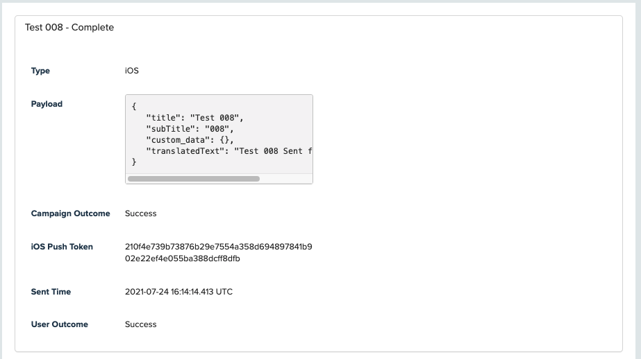
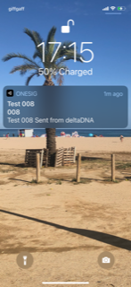
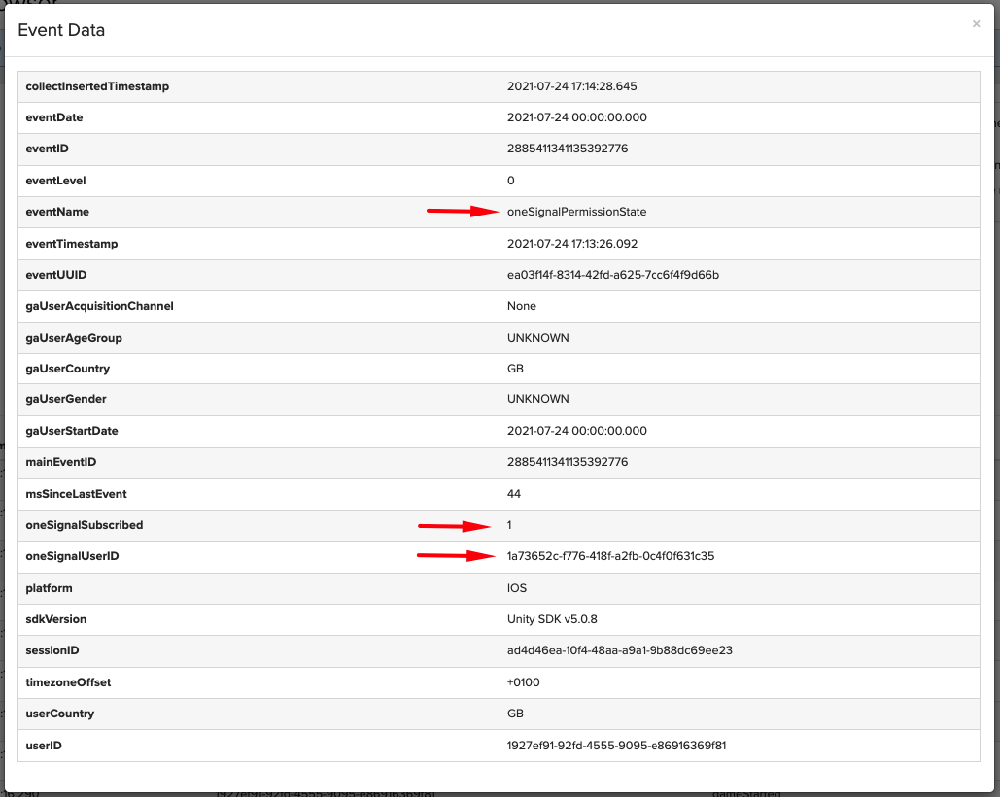
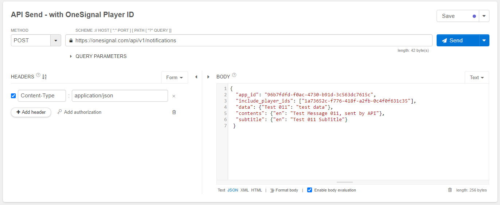
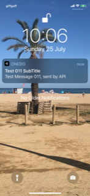
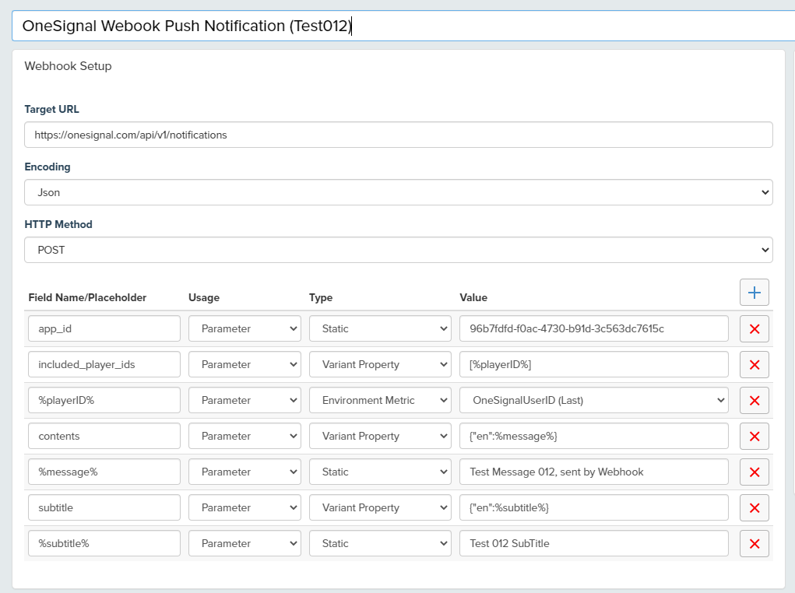

# OneSig
Project with OneSignal push notifications. The goal is to see if OneSignal notifications can be triggered from deltaDNA.

## Summary
* One Signal and deltaDNA SDK can co-exist on device. 
* Messages can be scheduled in OneSignal and Sent by OneSignal
* Messages can be scheduled in deltaDNA and Sent by deltaDNA

## One Signal Setup
The first step is to integrate One Signa and send a simple push notification.

1. Created empty Unity 2018.4 project
2. Created 'Apple Distribution' Certificate following [Unity publishing for IOS Tutorial](https://learn.unity.com/tutorial/publishing-for-ios#5ecf9859edbc2a001f63c65b)
3. Unity - Switch Build Settings to IOS
4. Downloaded P12 key (pwd N0tifyM3!)
5. Created seperate Apple Push (Sandox and Production) Certificate followin [One Signal Guide](https://documentation.onesignal.com/docs/generate-an-ios-push-certificate)
6. Downloaded P12 key (pwd N0tifyM3!)
7. Imported One Signal SDK into Unity
8. Added OneSignal example code and AppID
9. Build and Run on device. Did register for IOS Push Notifications ```210f4e739b73876b29e7554a358d694897841b902e22ef4e055ba388dcff8dfb```
10. Created new notification
11. Received new notification 


## deltaDNA Setup
1. Downloaded and imported deltaDNA Unity SDK v5.0.8
2. Configured deltaDNA in Unity Editor, connecting it to [OneSignal - Notification Test project](https://www.deltadna.net/demo-account/one-signal-notification-test)
3. Minimal code added to Start deltaDNA SDK and nothing more
4. Built and run on device, events confirmed in Event Browser Tool for userID ```1927ef91-92fd-4555-9095-e86916369f81```
5. deltaDNA SDK recognises that OneSignal has permission to send notifications and therefore sends a deltaDNA **notificationServices** event containing the same device token as is sent to OneSignal
6. Loaded the push certificate, P12 private key and password into deltaDNA Manage Identity page. *This is the same key as uploaded to One Signal* 
7. Created a new notification  in the deltaDNA Message Test tool and sent it.
8. Confirmed that the notifiation from deltaDNA was received 

*NB: It is not necessary to call any of the DDNA notification configuration code on the client as One Signal is already registering for notifications*

9. Added custom event schema to deltaDNA event manager, to record OneSignal userID and Subscription status to deltaDNA at the start of each session
10. Added code to fire the new event at the start of each session using the contents of ```OneSignal.GetPermissionSubscriptionState().subscriptionStatus```

```c#
    public void RecordOneSignalStatusEvent(OSSubscriptionState subscriptionState)
    {
        if (subscriptionState != null)
        {
            GameEvent e = new GameEvent("oneSignalPermissionState")
                .AddParam("oneSignalSubscribed", subscriptionState.subscribed)
                .AddParam("oneSignalUserID", subscriptionState.userId);                

            DDNA.Instance.RecordEvent(e);
        }
    }
```
11. Confirmed the event was being recorded correctly in the deltaDNA Event Browser

12. Send deltaDNA userID to OneSignal, for later use as an **external_user_id** by OneSignal SDK and APIs

## OneSignal REST API
Initiate a message on deltaDNA and deliver through OneSignal.

**Usecase** : DeltaDNA data driven player selection sends WEBHOOK campaign content to OneSignal REST API which delivers message to player.
1. Retrieve [OneSignal API Key](https://documentation.onesignal.com/docs/accounts-and-keys).
2. Use REST API [Create Notification](https://documentation.onesignal.com/docs/accounts-and-keys) method to send a test notificaton to player to check API parameters.

3. Confirm REST API message delivered successfully 

4. Create a Webhook campaign action
*I'm running into problems here, due to the more complex objects the API requires 

