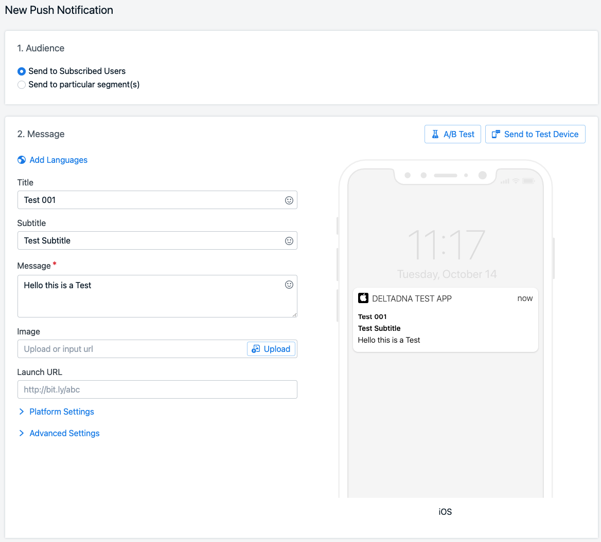
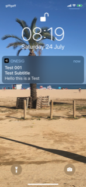

# OneSig
Project with OneSignal push notifications. The goal is to see if OneSignal notifications can be triggered from deltaDNA webhooks.

## One Signal Setup
The first step is to integrate One Signa and send a simple push notification.

1. Created empty Unity 2018.4 project
2. Created 'Apple Distribution' Certificate following [Unity publishing for IOS Tutorial](https://learn.unity.com/tutorial/publishing-for-ios#5ecf9859edbc2a001f63c65b)
3. Unity - Switch Build Settings to IOS
4. Downloaded P12 key (pwd N0tifyM3!)
5. Created seperate Apple Push (Sandox and Production) Certificate followin [One Signal Guide](https://documentation.onesignal.com/docs/generate-an-ios-push-certificate)
6. Downloaded P12 key (pwd N0tifyM3!)
7. Imported One Signal SDK into Unity
8. Added OneSignal example code and AppID
9. Created new notification
10. Received new notification 



## deltaDNA Setup
1. Downloaded and imported deltaDNA Unity SDK v5.0.8
2. Configured deltaDNA in Unity Editor, connecting it to [OneSignal - Notification Test project](https://www.deltadna.net/demo-account/one-signal-notification-test)
3. Built and run on device, events confirmed in Event Browser Tool for userID ```1927ef91-92fd-4555-9095-e86916369f81```